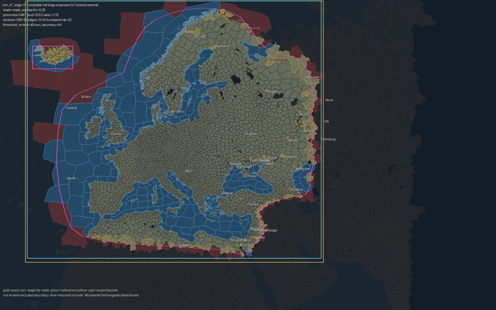
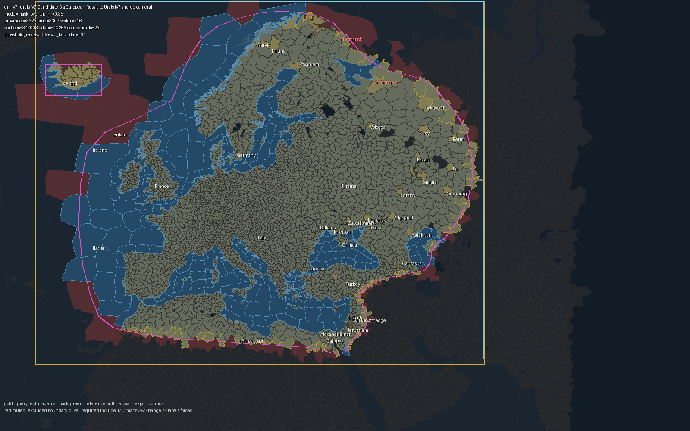

# Earth3 v7 eastward extent — owner decision package

**Status:** pending owner visual approval. **Production theatre unchanged (v6 / 3345).**

## Candidates

### V7 Candidate A — Volga expansion (em_v7_volga)

| Metric | Value |
|------|------:|
| Provinces | **3467** (Δ v6 +122) |
| Land / water | 3252 / 215 |
| included_ids_sha256 | 5c05ba0b80fb23bcd4343d24a527b3d7d616f5a66ff705c420544d8f3bdd7fda |
| Vertices | 338143 |
| Triangles (estimate) | 350466 |
| Source bounds W×H | 3927 × 3433 |
| Est. Godot load | ~1088 ms |
| Est. snapshot size | ~846 KB |

### V7 Candidate B — European Russia to Urals (em_v7_urals)

| Metric | Value |
|------|------:|
| Provinces | **3523** (Δ v6 +178) |
| Land / water | 3307 / 216 |
| included_ids_sha256 | e8dd0dd16ac06d035398e079f0736a97c2fe39bbb4434cc6c6c119067b490dda |
| Vertices | 347003 |
| Triangles (estimate) | 315982 |
| Source bounds W×H | 4290 × 3433 |
| Est. Godot load | ~1105 ms |
| Est. snapshot size | ~860 KB |

## Closeup: western_russia

- em_v7_volga: closeups/em_v7_volga_western_russia.png
- em_v7_urals: closeups/em_v7_urals_western_russia.png

## Closeup: arkhangelsk_white_sea

- em_v7_volga: closeups/em_v7_volga_arkhangelsk_white_sea.png
- em_v7_urals: closeups/em_v7_urals_arkhangelsk_white_sea.png

## Closeup: volga_corridor

- em_v7_volga: closeups/em_v7_volga_volga_corridor.png
- em_v7_urals: closeups/em_v7_urals_volga_corridor.png

## Closeup: urals_boundary

- em_v7_volga: closeups/em_v7_volga_urals_boundary.png
- em_v7_urals: closeups/em_v7_urals_urals_boundary.png

## Closeup: caspian_astrakhan

- em_v7_volga: closeups/em_v7_volga_caspian_astrakhan.png
- em_v7_urals: closeups/em_v7_urals_caspian_astrakhan.png

## Recommendation

- Candidate A adds the operationally meaningful Volga axis (Arkhangelsk–Kazan–Samara–Volgograd–Astrakhan) and White Sea approach without committing to the full Ural industrial belt.
- Smaller province delta and load/snapshot cost while still answering the eastward-extent question for European Russia’s core river corridor.
- Candidate B is the natural max-east European-Russia option if the Urals should be a permanent hard boundary (Perm/Bashkortostan/Orenburg depth).
- Neither candidate is approved; production remains v6 until owner visual sign-off.

## Federal subjects (metadata / overlay — not playable cells)

Playable cells remain Earth3 provinces (e3_*). Russian federal subjects are grouping metadata / overlay only — never replace province geometry.

- **Moscow (federal city)** vs Moscow Oblast: subject_id on provinces + optional boundary overlay; city provinces tagged federal_city=true
- **Saint Petersburg (federal city)** vs Leningrad Oblast: same pattern; do not merge oblast into city cell
- **Other oblasts/krais/republics**: province.properties.federal_subject_id + name table; UI can tint/label without changing adjacency
