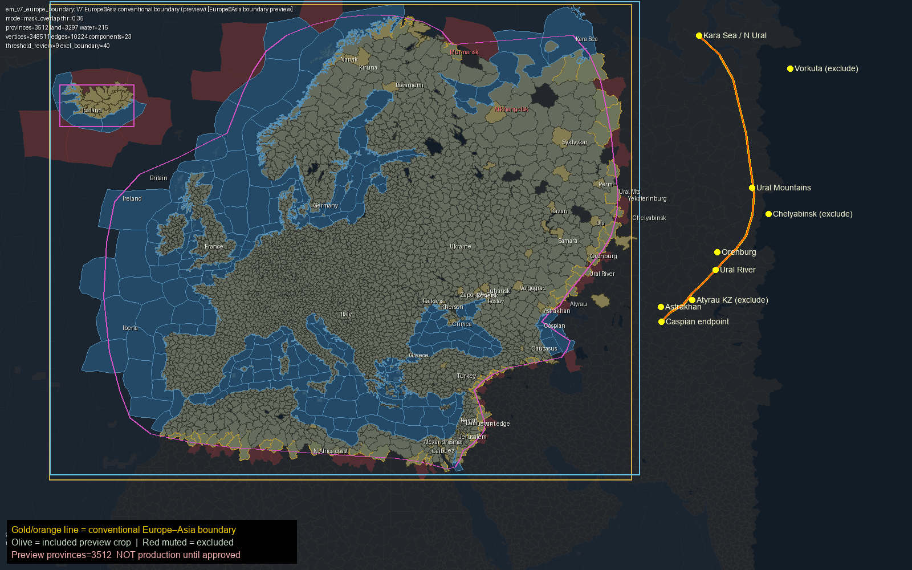

# v7 Europe–Asia boundary preview (awaiting owner approval)

**Status:** pending owner visual approval of this labelled boundary.

**Production remains v6 / 3345** (`b8768c9` / PR #104).  
This PR does **not** change production config, dataset, fixtures, tests, or runtime.

## Conventional boundary
Kara Sea / northern Ural → **Ural Mountains** → **Ural River** → northwestern **Caspian**.

## Labelled preview


## Preview crop metrics (NOT production)
| Metric | Value |
|------|------:|
| Provinces | **3512** |
| Land / water | **3297 / 215** |
| included_ids_sha256 | `507b0069a9572e915059ff6d21bd9f13a68cf62a26770c94a90c0b0e6a900be7` |

## Boundary crossings
See `BOUNDARY_CROSSINGS.json` — whole polygons only; include/exclude recommendations for straddlers.

## Closeups
- `closeups/urals_crest.png`
- `closeups/ural_river_caspian.png`
- `closeups/kara_northern_ural.png`
- `closeups/orenburg_astrakhan.png`

## Rebuild (local archive required)
```text
python tools/earth3/build_v7_europe_boundary_preview.py
```

No production PR may be opened until owner approves this boundary.
